# EKS Cluster with Bottlerocket managed node group

This document describes how to create EKS cluster with Bottlerocket worker nodes. 

## Cloud9 Environment

Whole exercise is done from Cloud9 Environment, therefore this is the first thing which needs to be created.

Login to the AWS console, select <strong>us-west-2</strong> region.


### Create IAM Role for EC2 instance of Cloud9

We need to create IAM role which will be used by EC2 instance of Cloud9 Environment.

In the AWS console go to the IAM service, select Roles and click on Create role button.

Under Trusted entity type chose AWS Service and select EC2 as Use case. 

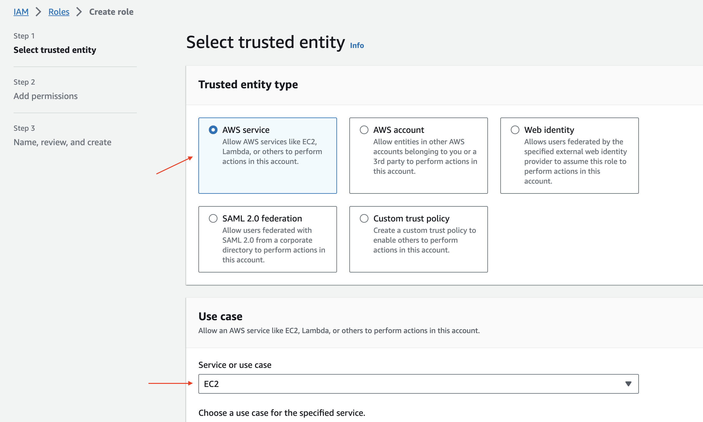

Click next button. Select AdministratorAccess policy and attach it to the role. 

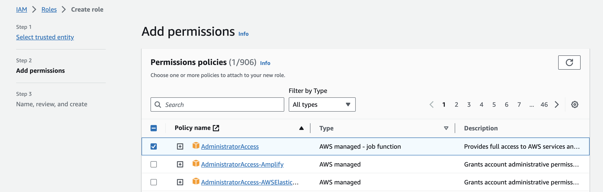

Give the role name BottlerocketCloud9Admin and create it.

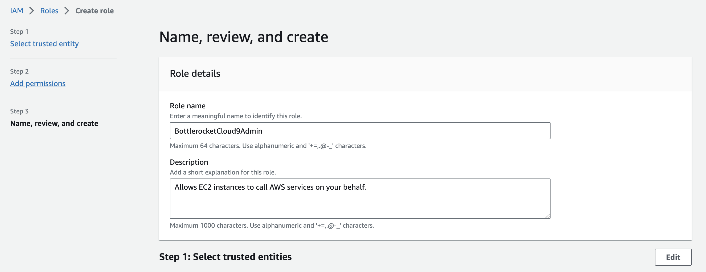

### Create Cloud9 Environment

In the AWS console go to the Cloud9 service and click on the Create environment button.

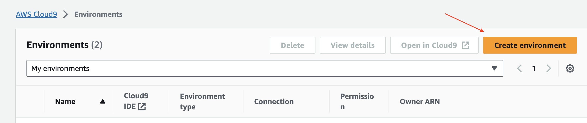

The name of the environment doesn’t matter. Choose any name you like. As environment type select `New EC2 Instance`.

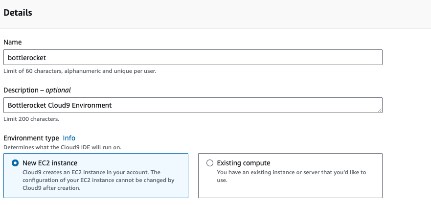

For instance type I have selected t3.medium but feel free to choose any instance type of your choice. As platform select <strong>Amazon Linux 2</strong> because scripts which needs to be executed later are tested on that Linux distribution.

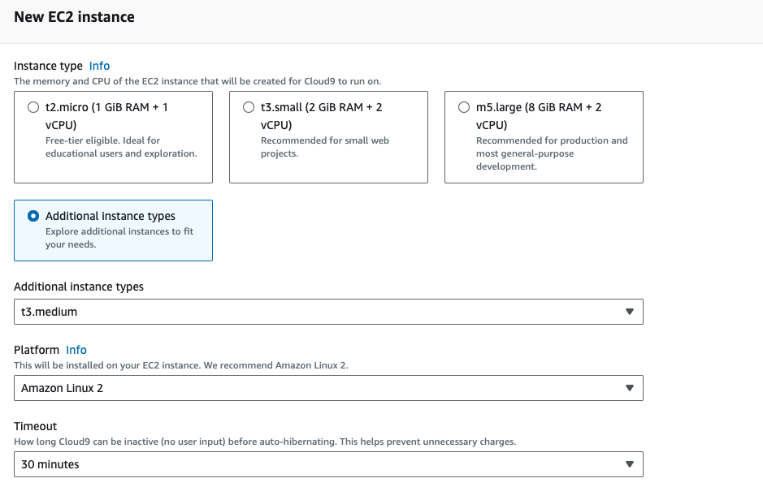

I have created Cloud9 environment in default VPC. This is not a must but the ec2 instance must be in subnet which can access internet. Therefore, pick a public subnet or private subnet which has Nat Gateway.

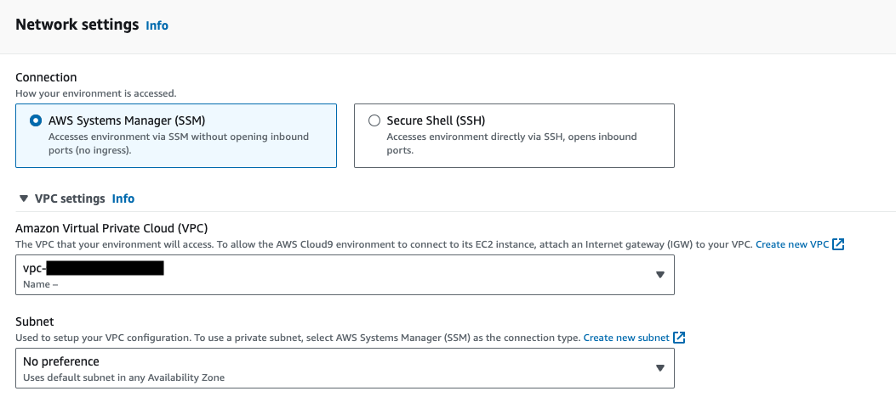

### Configure Cloud9 Environment

Go to EC2 service and find cloud9 ec2 instance. Select EC2 instance and click on Actions dropdown menu, select Security and then select Modify IAM role. 

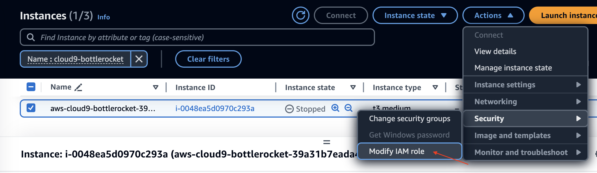

From the menu select IAM role which you created earlier and click on Update IAM role


Go to Cloud9 service and open environment which you created and select preferences

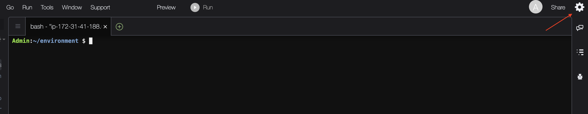

Disable AWS managed temporary credentials and close preferences

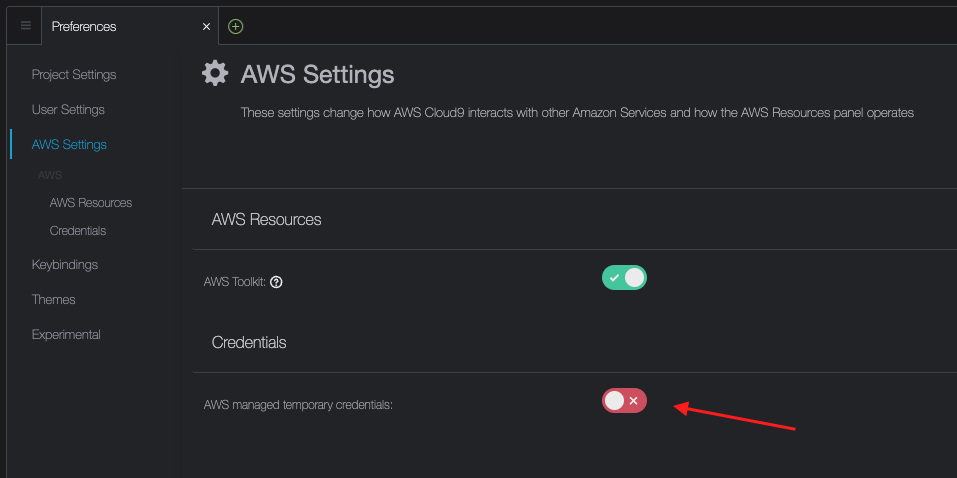

Click on the plus sign and select New Terminal

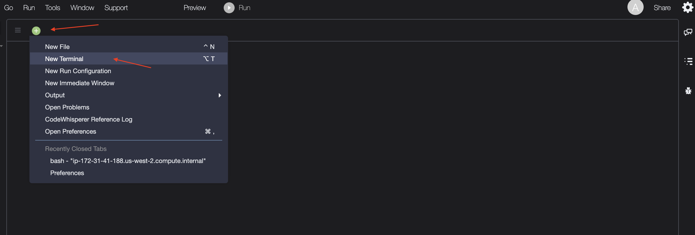

Inside of terminal type the following commands in order to clone the reposotory and run setup.sh script to install required command line tools.

```bash
git clone https://github.com/dnabic-aws/eks-bottlerocket.git

cd eks-bottlerocket && bash setup.sh
```

## EKS cluster

### Create EKS Cluster

From terminal of Cloud9 environment create ec2 key pair

```bash
aws ec2 create-key-pair \
  --key-name eks_bottlerocket \
  --key-type rsa \
  --query "KeyMaterial" \
  --output text > eks_bottlerocket.pem
```

You should still be in directory of the cloned repository.

Run the following command to create EKS cluster:

```bash
eksctl create cluster -f bottlerocket_eks_cluster.yaml
```

It might take 10 to 15 minutes to finish.

### Connecting to EKS cluster

Check the current identity to verify that you're using the correct credentials that have permissions for the Amazon EKS cluster:

```bash
aws sts get-caller-identity
```

Create or update the <strong>kubeconfig</strong> file for your cluster:

```bash
aws eks --region us-west-2 update-kubeconfig --name bottlerocket
```

Check the status of worker nodes. Nodes should be in Read state and should have Bottlerocket OS image.

```bash
kubectl get nodes -o wide
```

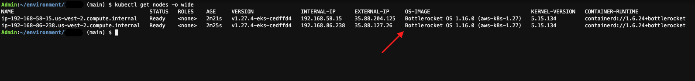

### Accessing Bottlerocket containers

Find instance IDs of EKS worker nodes

```bash
aws ec2 describe-instances --no-cli-pager --filters "Name=tag:aws:eks:cluster-name,Values=bottlerocket" --query "Reservations[*].Instances[*].{PrivateDNS:PrivateDnsName,InstanceID:InstanceId,Cluster:Tags[?Key=='aws:eks:cluster-name']|[0].Value,State:State.Name}" --output=table
```

Choose one of the instance IDs and connect to it through ssm

```bash
aws ssm start-session --target <instance-id>
```

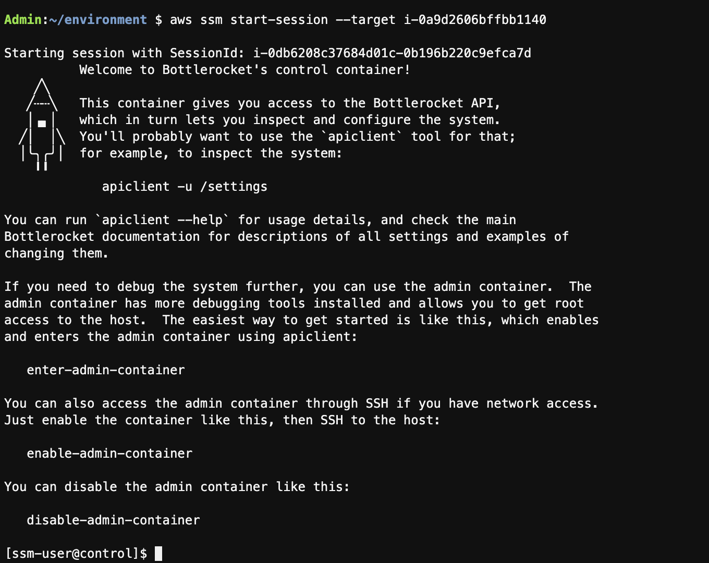

You are now inside of the control container of Bottlerocket instance. To configure or inspect the system you can use apiclient, for example:

```bash
apiclient -u /settings | jq
```

From control container enter the admin container

```bash
enter-admin-container
```

Inside of admin container you will have read only mounted host filesystem.

You can for example inspect kubelet configuration


```bash
cat /.bottlerocket/rootfs/etc/kubernetes/kubelet/config
```

You can also install tools you need for debugging. For example, if you need <strong>ping</strong> and <strong>traceroute</strong> to debug network issues:

```bash
yum install traceroute iputils -y
```

To permit more intrusive troubleshooting on the Bottlerocket host execute:

```bash
sudo sheltie
```

For example, now you can check kubelet logs:

```bash
journalctl -u kubelet
```

Or you can check the status of apiserver:

```bash
systemctl status  apiserver
```

Type <strong>exit</strong> to leave sheltie.

Type <strong>exit</strong> to leave admin container.

Inside of control container disable admin container


```bash
disable-admin-container
```

Type <strong>exit</strong> to leave control container.
